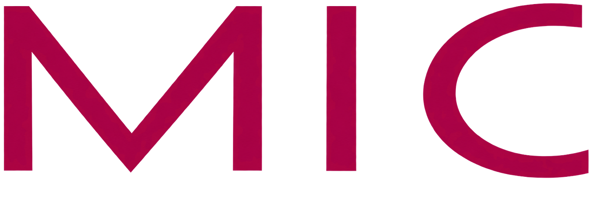
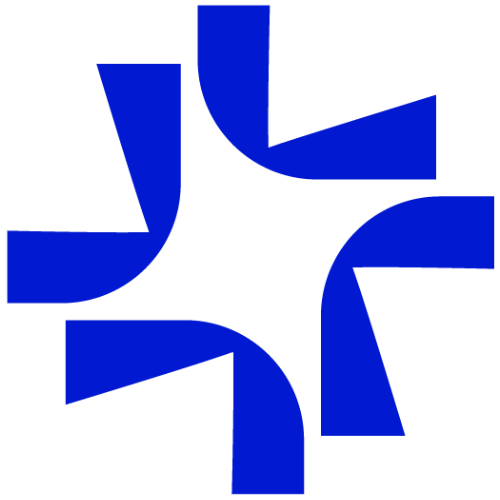

# Hi, I'm Omayma

### Full-Stack Web Developer | MERN Stack Enthusiast | Computer Science Engineering Student

I'm a Computer Engineering & Artificial Intelligence student at ENSA Safi,  
currently focusing on building modern and scalable web applications.

---

## What I'm Working With

- **Frontend:** React, Next.js, Vue.js, HTML, CSS, JavaScript
- **Backend:** Node.js, Express.js, REST APIs
- **Databases:** MongoDB, PostgreSQL, Firebase
- **Tools:** Git, GitHub, Postman, Figma

---

## Most Used Languages

  

---

## Professional Experience

<table width="100%">
  <tr>
    <td width="40%" align="center" valign="middle">
      
    </td>
    <td width="60%" valign="middle">
      <strong>Stagiaire Développeuse Full-Stack / Agent IA</strong>
       
      <strong>MIC</strong>
       
      <em>Juillet – Septembre 2026</em>
        
      <strong>Project</strong>
      <strong>TIZIRI: AI Agent </strong>
       
      RAG · LLMs · LangGraph · Django
    </td>
  </tr>

  <tr>
    <td width="40%" align="center" valign="middle">
      
    </td>
    <td width="60%" valign="middle">
      <strong>Stagiaire Développeuse Full-Stack</strong>
       
      <strong>OCTICODE</strong>
       
      <em>Juin – Août 2025</em>
        
      <strong>Projects</strong>
      <strong>Vulnura</strong>
       
      Next.js · React.js · TypeScript
        
      <strong>Big Fournitures</strong>
       
      WordPress · WooCommerce
    </td>
  </tr>
</table>

---

## Skills

  

---

## Currently Learning

- Full-Stack Architecture
- Testing & Clean Code
- AI Agents & Agentic AI
- LLM APIs & Tool Calling
- AI-powered Applications

---

## Currently Building

### MoroMatch — AI & Talent Matching Platform

Currently contributing to **MoroMatch**, an AI-powered platform built to connect Moroccan talents, recruiters, and career opportunities.

**Focus:** AI-powered matching • Talent discovery • Recruitment

[Explore MoroMatch →](https://moromatch.com/)

---

## Featured Projects

### HANOUTY.AI

An AI-powered smart checkout system using computer vision for automated product detection in real time.

**Tech:** React • FastAPI • YOLOv8 • IoT

### Intelligent IDS/IPS System

A hybrid cybersecurity system combining Machine Learning and Deep Reinforcement Learning for automated threat detection and prevention.

### TSWIRTI

A full-stack real-time image processing platform built with React and FastAPI.

### MedClick

A full-stack dental clinic management platform built with the MERN stack, featuring secure authentication and appointment management.

---

## My Resume

  

  Full-Stack Web Developer • MERN • Agentic AI

---

## Connect With Me

  

  

  

  

